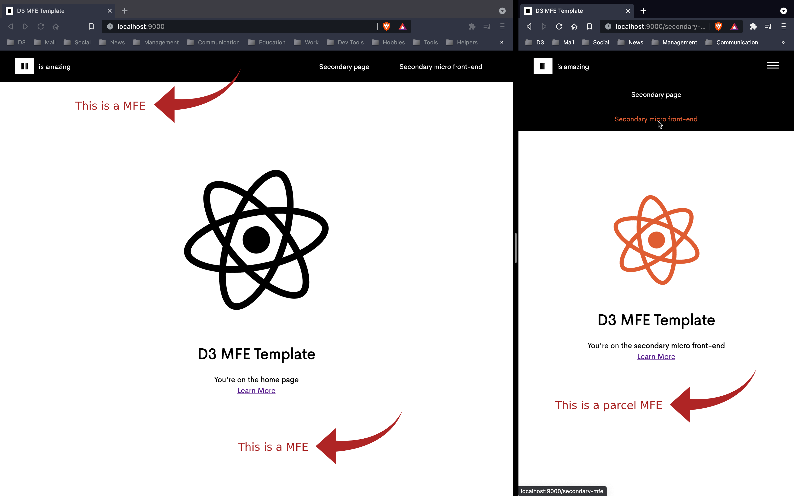

 
<h1  align="center">🧩 D3 MICRO FRONT-END LIB ⚛️</h1>

Geralmente definir as configurações de ambiente de um projeto é muito complicado, burocratico e leva MUITO tempo<br/>
O D3 MFE Lib é um template que foi gerado a partir do [D3 LIB]<br/>
Os objetivos dessa Lib são:
<br/><br/>
	✔️ Fazer com que o dev economize horas ou até dias que iria gastar configurando o ambiente<br/>
	✔️ Novos integrantes do time estudar MFE com uma base sólida<br/>
	✔️ Criarmos experimentos usando a lib e aprimorarmos os projetos front-ends<br/>
	✔️ Automatizar processos<br/>
	✔️ Centralizar todos os temas da D3, incluindo as fontes, cores e assets<br/>
	✔️ Dependências e estrutura de pastas configurados<br />
	✔️ Uso do Docker<br/>

## 🛠️ Tecnologias utilizadas
- Shell
- Javascript
- React and Router DOM
- Docker
- Single-SPA
- Cypress
- Husky
- Jest
- ESLint and Prettier
- Styled-components
- Git, Github

## 🔎 Pré-requisitos <br/>
- `Git`
- `Bash`
- `Docker`

## ▶️ Getting Started
- Entre no [repositorio] e clique em `Use this template` 

- Você deve setar um Owner, defina um nome para o repositório e depois selecione `Include all branches`

- Clone o repositório, exemplo:

```bash

$ git clone git@github.com:d3estudio/d3-lib-mfe.git

```

- Com o terminal, abra o diretório do template

```bash

$ cd d3-mfe-lib

```

- Agora você pode usar o terminal para executar um dos 4 scripts da lib:<br/>
	- 💿 <b>build</b>: executa todos os docker-compose, monta todas as imagens e sobe os containers
	- 💿 <b>clone</b>: clona todos os repositórios
	- 💿 <b>d3shell</b>: A função desse script é iniciar uma sessão de terminal com autenticação SSH para os repositórios da D3. Ao dar o comando bash d3shell.sh o script irá te guiar na criação de uma chave SSH (caso você não possua), configuração da chave no github (caso ainda não esteja configurada) e gerenciamento da sua chave na máquina. Se você já possui uma chave configurada, o script vai apenas iniciar a sessão do terminal autenticada.
	- 💿 <b>deploy</b>: Utilize o script deploy.sh para automatizar o deploy de suas aplicações, podendo também fazer o deploy automático a partir de sua maquina, assim como em diversas plataformas com suas configurações. O que facilita a integração e estruturação inicial do projeto, trazendo flexibilidade para diversos contextos.

- Com o terminal use o script d3shell, o script irá te guiar na criação de uma chave SSH (caso você não possua)

```bash

$ bash d3shell.sh

```

- Clonando todos os repositórios dos MFES

Digite no terminal 

```bash

$ bash clone.sh

```

<i>ele irá clonar os repositórios que você incluiu no arquivo `.config` inclusive a `branch`, `hash`, e `path` especifico</i><br/>

- Será criado uma pasta `src` dentro do template com os repositórios já clonados

### Estrutura do ambiente:
- 📂 <b>src</b>: Contém todos os MFEs:
    - 📂 <b>[root]</b>: MFE orquestrador <br/>
    - 📂 <b>mfes</b>: Todos os sub MFEs: <br/>
		- 📂 <b>[app-mfe]</b>: MFE main<br/>
		- 📂 <b>[navbar-mfe]</b>: Navbar<br/>
		- 📂 <b>[secondary-mfe]</b>: MFE parcel que será carregado dentro do MFE main<br/>

Agora voce pode usar o `build.sh` para fazer o build de todas as imagens dos MFES e rodar os seus containers:

Digite no terminal

```bash 

$ bash build.sh

```

A aplicação irá rodar no http://localhost:9000/ 

## Personalize:<br/>
- ⚙️ <b>.config</b>: SSH dos repositórios, branch, commit hash
- 🐋 <b>docker-compose</b>: imagens, containers, volumes, portas, network de todos os repositórios
- 🐋 <b>Dockerfile</b><br/><br/>

- 📂 src / <b>root</b><br/>
	- ⚙️ <b>husky</b>
	- 🧪 <b>cypress</b>: os testes ficam na pasta `integration`, para executar o teste E2E use `npm test`
	- 📂 public
		- 🖼️ <b>favicon</b>
		- 📂 utils
			- 📄 <b>importmap</b>: importe o caminho de todos os endereços dos MFES aqui
	- 📂 src
		- 📄 <b>index.ejs</b>: edite varias coisas por aqui como: title, import das CDNs
		- 📄 <b>microfrontend-layout</b>: O mapa das applications "MFEs", um overview<br/>
		<i>exceto aplicações `parcel` porque eles são importados dentro de outro MFE</i>
	- 📄 <b>package</b>: dependencias<br/><br/>

- 📂 src / <b>mfes</b> / ...
	- ⚛️ <b>components</b>
	- ⚛️ <b>pages</b>
	- 💅 <b>styles</b>
	- 💅 <b>global styles</b>
	- 🎨 <b>theme</b>
	- 🧪 <b>unit tests</b>
	- 🚏 <b>routes</b>
	- 🖌 <b>eslint and prettier</b>
	- 📄 <b>.env</b><br/>
<br/>

## Screenshot

 
<br/>

[D3 LIB]: https://github.com/d3estudio/d3-lib
[repositorio]: https://github.com/d3estudio/d3-lib-mfe
[root]: https://github.com/d3estudio/d3-lib-mfe-root
[app-mfe]: https://github.com/d3estudio/d3-lib-mfe-app
[navbar-mfe]: https://github.com/d3estudio/d3-lib-mfe-navbar
[secondary-mfe]: https://github.com/d3estudio/d3-lib-mfe-secondary
